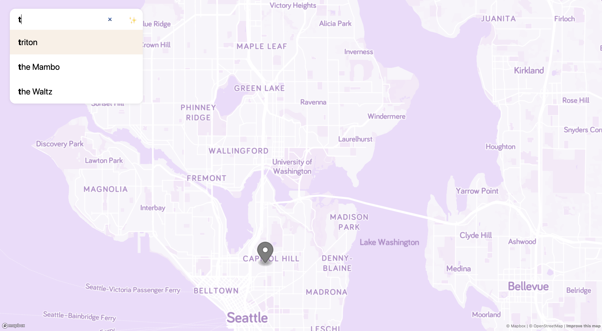

# Husky Maps

An educational web app for mapping the world, searching for places, and navigating around Seattle. The app is designed to highlight 3 components: [**Autocomplete**](src/autocomplete/), [**Priority Queues**](src/minpq/), and [**Seam Finding**](src/seamfinding/). See the [**Releases**](https://github.com/kevinlin1/huskymaps/releases) for instructions about each project component.

## Setup

This project is pre-configured for IntelliJ IDEA.

1. Install [IntelliJ IDEA](https://www.jetbrains.com/idea/download/).
1. Download or clone this project and open it in IntelliJ.
1. Run the `MapServer` class to start the web app.

To see the map images, [sign up for a free MapBox account](https://account.mapbox.com/auth/signup/?route-to=%22https://account.mapbox.com/access-tokens/%22) to get an access token. Once you have your access token, in the IntelliJ toolbar, select the "MapServer" dropdown, **Edit Configurations...**, under **Environment variables** write `TOKEN=` and then paste your token. Re-run the `MapServer` class to launch the web app and enjoy the ["Ice Cream" map style by Maya Gao](https://www.mapbox.com/gallery/).

## Deployment

One way to share Java apps is by distributing them as a **JAR** that bundles all your code together into a single file.

1. Open IntelliJ. From the **File** menu, select **Project Structure...** and **Artifacts** from the sidebar.
1. Press the **+** button to add a new **JAR** and select **From module with dependencies**.
1. In the pop-up window, select **MapServer** as the main class and press **OK**.
1. Edit the name from "huskymaps:jar" to "huskymaps" and press **OK** to close the project structure dialog.
1. From the **Build** menu, select **Build Artifacts** and build **huskymaps**.
1. Test your JAR by running it from the terminal. In IntelliJ, [open the terminal](https://www.jetbrains.com/help/idea/terminal-emulator.html#open-terminal), and run `TOKEN=... java -jar out/artifacts/huskymaps/huskymaps.jar`.

To deploy the app to the web, we'll share this JAR file with a web hosting provider such as [fly.io](https://fly.io). fly.io provides a free web hosting service where anyone can sign-up to deploy their apps to the internet at no cost (no payment method needed).

1. [Install flyctl](https://fly.io/docs/hands-on/install-flyctl/) and [sign up](https://fly.io/docs/hands-on/sign-up/).
1. Start (but don't complete!) the process for [deploying your application via Dockerfile](https://fly.io/docs/languages-and-frameworks/dockerfile/). For the app name, use the name `huskymaps-` with your UW NetID after the dash. When it asks you to deploy, don't do so just yet!
1. Open the `fly.toml` file in a text editor and set the `force_https` option to false.
1. Share your MapBox access token with fly as an app secret with the terminal command `fly secrets set TOKEN=...`.
1. Finally, deploy the app with the terminal command `fly deploy`.
